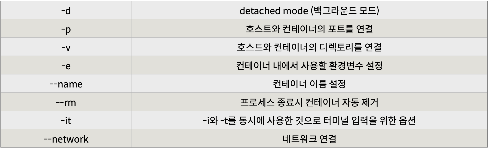

# 도커 엔진

## Docker?

```markdown
기존의 `가상화 기술`은 하이퍼바이저를 이용해 여러 개의 운영체제를 하나의 호스트에서 생성해 사용하는 방식
이러한 여러 개의 운영체제는 가상 머신이라는 단위로 구별되고, 각 가상머신에는 운영체제가 설치되어 사용된다.
> 하이퍼바이저에 의해 생성되고 관리되는 운영체제는 게스트 운영체제`(Guest OS)`라 하고, 각 게스트 운영체제는 다른 게스트와는 완전히 독립된 공간과 시스템 자원을 할당받아 사용한다.
```


```markdown
도커 컨테이너는 가상화된 공간을 생성하기 위해 리눅스 자체기능인 chroot, 네임스페이스, cgroup을 사용함으로써 프로세스 단위의 격리 환경을 만들기 때문에 성능 손실이 거의 없다.
컨테이너에 필요한 커널은 `호스트의 커널을 공유`해 사용하고,컨테이너 안에는 애플리케이션을 구동하는 데 필요한 라이브러리 및 실행 파일만 존재하기 때문에 컨테이너를 이미지로 만들었을 때 이미지의 용량 또한 가상머신에 비해 대폭 줄어든다. 
```

* 도커 엔진에서 사용하는 기본 단위는 `이미지`와 `컨테이너`이며, 이 두가지가 **도커엔진의 핵심**이다.
* **이미지**는 컨테이너를 생성할 때 필요한 요소이며, 가상 머신을 생성할 때 사용하는 `iso` 파일과 비슷한 개념이다.

> 도커에서 사용하는 이미지의 이름은 **[저장소 이름]/[이미지 이름]:[태크]**의 형태로 구성된다.

## Docker Install

>  AWS EC2 사용하기 [Mac m1은 VirtualBox 사용이 불가하므로...]

* `.pem` 키 권한 변경

  ```shell
  soyun@yunsoyun-ui-MacBookPro docker % chmod 600 ubuntu-docker.pem
  ```

* 접속하기

  ```shell
  soyun@yunsoyun-ui-MacBookPro docker % ssh -i ubuntu-docker.pem ubuntu@13.209.18.250
  Welcome to Ubuntu 18.04.5 LTS (GNU/Linux 5.4.0-1045-aws x86_64)
  
   * Documentation:  https://help.ubuntu.com
   * Management:     https://landscape.canonical.com
   * Support:        https://ubuntu.com/advantage
  ```

* 리눅스 도커 엔진 설치

  ```shell
  $ curl -fsSL https://download.docker.com/linux/ubuntu/gpg | sudo apt-key add -
  OK
  
  $ sudo su - # root 권한
  $ add-apt-repository "deb [arch=amd64] https://download.docker.com/linux/ubuntu $(lsb_release -cs) stable"
  ''
  
  $ apt-get update
  $ apt-get install docker-ce
  ```

  * 설치 완료 후 도커 엔진 정보 출력

  ```shell
  $ docker info
  ...
  Server:
   Containers: 0
    Running: 0
    Paused: 0
    Stopped: 0
   Images: 0
   Server Version: 20.10.7
  ```

  * 도커 엔진 버전 확인

  ```shell
  $ docker -v
  Docker version 20.10.7, build f0df350
  ```

  

## 컨테이너 생성

### docker run

* `docker run` : 컨테이너 생성 및 실행

  * `-i -t` 옵션은 컨테이너와 상호 입출력이 가능하게 한다.
  * `-i` : 상호 입출력
  * `-t` : `tty` 활성화해서 bash 셸 사용
  * `run` 명령어는 `pull`, `create`, `start` 명령어를 일괄적으로 실행한 후 컨테이너 내부로 들어간다.

  

  ```shell
  root@ip-172-31-5-197:~# docker run -it ubuntu:14.04
  Unable to find image 'ubuntu:14.04' locally
  # ubuntu:14.04 이미지가 로컬 도커 엔진에 존재하지 않으므로 도커 중앙 이미지 저장소인 도커 허브에서 자동으로 이미지 내려받음
  Status: Downloaded newer image for ubuntu:14.04
  ```

  * `run` 명령어 사용하면 사용할 이미지가 저장되어 있는지 확인하고 없다면 다운로드(pull) 한 후 컨테이너를 생성(create)하고 시작(start)한다.
  * 컨테이너는 정상적으로 실행됐어도 명령어를 전달하지 않았기 때문에 컨테이너는 생성되자마자 종료된다. 
    * 컨테이너는 **프로세스**이기 때문에 실행중인 프로세스가 없으면 종료된다.

  ```shell
  soyun@yunsoyun-ui-MacBookPro docker % docker run ubuntu:20.04
  Unable to find image 'ubuntu:20.04' locally
  20.04: Pulling from library/ubuntu
  a39c84e173f0: Pull complete 
  Digest: sha256:626ffe58f6e7566e00254b638eb7e0f3b11d4da9675088f4781a50ae288f3322
  Status: Downloaded newer image for ubuntu:20.04
  ```

  * 컨테이너 내부에 들어가기 위해 `sh` 를 실행하고 키보드 입력을 위해 `-it` 옵션을 준다.
  * 프로세스가 종료되면 컨테이너가 자동으로 삭제되도록 `--rm` 옵션도 추가해준다.
    * `--rm`  이 없다면 컨테이너가 종료되더라도 삭제되지 않고 남아있어 수동으로 삭제해줘야 한다.

  ```shell
  soyun@yunsoyun-ui-MacBookPro docker % docker run --rm -it ubuntu:20.04 /bin/sh
  # 
  # ls
  bin   dev  home  media	opt   root  sbin  sys  usr
  boot  etc  lib	 mnt	proc  run   srv   tmp  var
  ```

* 웹 애플리케이션 실행

  * detached mode(백그라운드 모드)로 실행하기 위해 `-d` 옵션을 추가하고 `-p`  옵션을 추가하여 컨테이너 포트를 호스트의 포트로 연결했다.
  * 브라우저를 열고 localhost:5678에 접속하면 메시지 볼 수 있다.

  ```shell
  soyun@yunsoyun-ui-MacBookPro docker % docker run --rm -p 5678:5678 hashicorp/http-echo -text="hello world"
  ```

### Redis

> Redis라는 메모리기반 데이터베이스를 실행한다.

```shell
soyun@yunsoyun-ui-MacBookPro docker % docker run --rm -p 1234:6379 redis
Unable to find image 'redis:latest' locally
latest: Pulling from library/redis
a9eb63951c1c: Pull complete 
5054a5c2f9e4: Pull complete 
2762e8714463: Pull complete 
3eb8811ecaeb: Pull complete 
e84eb4291cbc: Pull complete 
86fb387cf9d9: Pull complete 
Digest: sha256:a89cb097693dd354de598d279c304a1c73ee550fbfff6d9ee515568e0c749cfe
Status: Downloaded newer image for redis:latest
1:C 27 Oct 2021 13:49:59.105 # oO0OoO0OoO0Oo Redis is starting oO0OoO0OoO0Oo
1:C 27 Oct 2021 13:49:59.105 # Redis version=6.2.6, bits=64, commit=00000000, modified=0, pid=1, just started
1:C 27 Oct 2021 13:49:59.105 # Warning: no config file specified, using the default config. In order to specify a config file use redis-server /path/to/redis.conf
1:M 27 Oct 2021 13:49:59.105 * monotonic clock: POSIX clock_gettime
1:M 27 Oct 2021 13:49:59.105 * Running mode=standalone, port=6379.
1:M 27 Oct 2021 13:49:59.105 # Server initialized
1:M 27 Oct 2021 13:49:59.107 * Ready to accept connections


```

* Telnet 

  * 설치

    ```shell
    brew tap theeternalsw0rd/telnet
    brew install telnet
    ```

    

```shell
soyun@yunsoyun-ui-MacBookPro docker % telnet localhost 1234
Trying ::1...
Connected to localhost.
Escape character is '^]'.
set hello world
+OK
get hello
$5
world
quit
+OK
Connection closed by foreign host.
```


### docker pull

* `docker pull` : 이미지를 내려받을 때(수동 다운로드) 사용

  ```shell
  root@ip-172-31-5-197:~# docker pull centos:7
  7: Pulling from library/centos
  2d473b07cdd5: Pull complete 
  Status: Downloaded newer image for centos:7
  docker.io/library/centos:7
  ```

* `docker images` : 도커 엔진에 존재하는 <u>이미지의 목록</u> 출력

  ```shell
  soyun@yunsoyun-ui-MacBookPro docker % docker images
  REPOSITORY            TAG       IMAGE ID       CREATED        SIZE
  wordpress             latest    f39e6618eae2   4 days ago     562MB
  mysql                 5.7       938b57d64674   8 days ago     448MB
  ubuntu                20.04     d5ca7a445605   11 days ago    65.6MB
  redis                 latest    c3d77c9fc5b8   2 weeks ago    107MB
  centos                8         e6a0117ec169   5 weeks ago    272MB
  docker101tutorial     latest    3406c26ce2ef   3 months ago   26.9MB
  alpine                latest    b0e47758dc53   4 months ago   5.33MB
  alpine/git            latest    cfd9fa28a348   5 months ago   25.2MB
  hashicorp/http-echo   latest    a6838e9a6ff6   4 years ago    3.97MB
  ```

  * 컨테이너를 대상으로 하는 모든 명령어는 컨테이너 이름 대신 ID를 대신 쓸 수 있다. ( 너무 길 때는 앞의 2~3글자만 써도 OK. )

* `docker ps` : 생성한 컨테이너 목록 + 정지되지 않은 컨테이너만 출력한다.

  ```shell
  soyun@yunsoyun-ui-MacBookPro docker % docker ps
  CONTAINER ID   IMAGE       COMMAND                  CREATED          STATUS          PORTS                                                  NAMES
  d326fd7e8922   wordpress   "docker-entrypoint.s…"   9 minutes ago    Up 9 minutes    0.0.0.0:8080->80/tcp, :::8080->80/tcp                  vigilant_poincare
  befb31a73c24   mysql:5.7   "docker-entrypoint.s…"   22 minutes ago   Up 22 minutes   0.0.0.0:3306->3306/tcp, :::3306->3306/tcp, 33060/tcp   mysql
  bca00a79a335   redis       "docker-entrypoint.s…"   41 minutes ago   Up 41 minutes   0.0.0.0:1234->6379/tcp, :::1234->6379/tcp              wonderful_ptolemy
  ```

  * <u>정지된 컨테이너를 포함한 모든 컨테이너 출력</u>하려면 `-a` 옵션 추가

  ```shell
  soyun@yunsoyun-ui-MacBookPro docker % docker ps -a
  CONTAINER ID   IMAGE               COMMAND                  CREATED             STATUS                         PORTS                                                  NAMES
  d326fd7e8922   wordpress           "docker-entrypoint.s…"   9 minutes ago       Up 9 minutes                   0.0.0.0:8080->80/tcp, :::8080->80/tcp                  vigilant_poincare
  befb31a73c24   mysql:5.7           "docker-entrypoint.s…"   22 minutes ago      Up 22 minutes                  0.0.0.0:3306->3306/tcp, :::3306->3306/tcp, 33060/tcp   mysql
  bca00a79a335   redis               "docker-entrypoint.s…"   41 minutes ago      Up 41 minutes                  0.0.0.0:1234->6379/tcp, :::1234->6379/tcp              wonderful_ptolemy
  e760aec2c047   ubuntu:20.04        "bash"                   About an hour ago   Exited (0) About an hour ago                                                          boring_bartik
  9210dce9b25a   docker101tutorial   "/docker-entrypoint.…"   3 months ago        Exited (255) 3 months ago      0.0.0.0:80->80/tcp, :::80->80/tcp                      docker-tutorial
  fb3dcf51235c   alpine/git          "git clone https://g…"   3 months ago        Exited (0) 3 months ago                                                               repo
  ```

  * `exit` 사용해 빠져나온 컨테이너는 정지 상태
  * `Ctrl + P, Q` 입력해 빠져나온 컨테이너는 실행중

  ```shell
  root@ip-172-31-5-197:~# docker ps
  CONTAINER ID   IMAGE     COMMAND   CREATED   STATUS    PORTS     NAMES
  root@ip-172-31-5-197:~# docker ps -a
  CONTAINER ID   IMAGE          COMMAND       CREATED          STATUS                     PORTS     NAMES
  608717f340f5   ubuntu:14.04   "/bin/bash"   12 minutes ago   Exited (0) 8 minutes ago             beautiful_fermi
  ```

* `docker rm` : 컨테이너 삭제

  ```shell
  soyun@yunsoyun-ui-MacBookPro docker % docker rm fb3dcf51235c e760aec2c047 9210dce9b25a
  fb3dcf51235c
  e760aec2c047
  9210dce9b25a
  ```

  * `docker rm -f ID` : 실행 중인 컨테이너 삭제

  * `docker container prune` : 모든 컨테이너 삭제

  * `docker rmi image-name` : 도커 이미지 삭제

    ```shell
    soyun@yunsoyun-ui-MacBookPro docker % docker rmi hashicorp/http-echo
    Untagged: hashicorp/http-echo:latest
    Untagged: hashicorp/http-echo@sha256:ba27d460cd1f22a1a4331bdf74f4fccbc025552357e8a3249c40ae216275de96
    Deleted: sha256:a6838e9a6ff6ab3624720a7bd36152dda540ce3987714398003e14780e61478a
    Deleted: sha256:616807f11d1cd8b1e5cc9acaee8504953ea23d81388d17ed17809b9cc9ba840e
    ```

* `docker stop` : 컨테이너 정지

```shell
soyun@yunsoyun-ui-MacBookPro docker % docker stop bca00a79a335

bca00a79a335
```

```shell
# 모든 컨테이너 중지 및 삭제 
$ docker stop $(docker ps -a -q)
$ docker rm $(docker ps -a -q)
```

* `docker logs` : 도커 로그 확인

  ```shell
  soyun@yunsoyun-ui-MacBookPro docker % docker logs befb31a73c24
  # -f --tail : 새로 뜨는 로그 확인
  soyun@yunsoyun-ui-MacBookPro docker % docker logs -f befb31a73c24
  ```

  

  

## 컨테이너 외부에 노출

> 컨테이너는 가상 머신과 마찬가지로 <u>가상 IP 주소</u>를 할당받음
>
> 도커는 컨테이너에 `172.17.0.x` 의 IP를 순차적으로 할당한다.

```shell
root@9ca443c7e215:/# ifconfig
eth0      Link encap:Ethernet  HWaddr 02:42:ac:11:00:02  
          inet addr:172.17.0.2  Bcast:172.17.255.255  Mask:255.255.0.0
          UP BROADCAST RUNNING MULTICAST  MTU:1500  Metric:1
          RX packets:9 errors:0 dropped:0 overruns:0 frame:0
          TX packets:0 errors:0 dropped:0 overruns:0 carrier:0
          collisions:0 txqueuelen:0 
          RX bytes:806 (806.0 B)  TX bytes:0 (0.0 B)

lo        Link encap:Local Loopback  
          inet addr:127.0.0.1  Mask:255.0.0.0
          UP LOOPBACK RUNNING  MTU:65536  Metric:1
          RX packets:0 errors:0 dropped:0 overruns:0 frame:0
          TX packets:0 errors:0 dropped:0 overruns:0 carrier:0
          collisions:0 txqueuelen:1000 
          RX bytes:0 (0.0 B)  TX bytes:0 (0.0 B)
 # NAT IP 인 172.17.0.2를 할당받은 eth0 인터페이스
 # 로컬 호스트인 lo 인터페이스
```


* 외부에 컨테이너의 애플리케이션을 노출하기 위해서는 **eth0의 IP와 포트**를 **호스트의 IP와 포트**에 바인딩 해야한다.

   <u>[호스트의 포트]:[컨테이너의 포트]</u>

```shell
root@ip-172-31-5-197:~# docker run -i -t --name mywebserver -p 80:80 ubuntu:14.04
```

* 호스트의 특정 IP를 사용하려면 바인딩할 `IP:Port` 를 명시한다.

```shell
root@ip-172-31-5-197:~# docker run -i -t -p 192.168.0.100:7777:80 ubuntu:14.04
```

* 아파치 웹 서버 설치

```shell
$ apt-get update
$ apt-get install apache2 -y
$ service apache2 start
```

