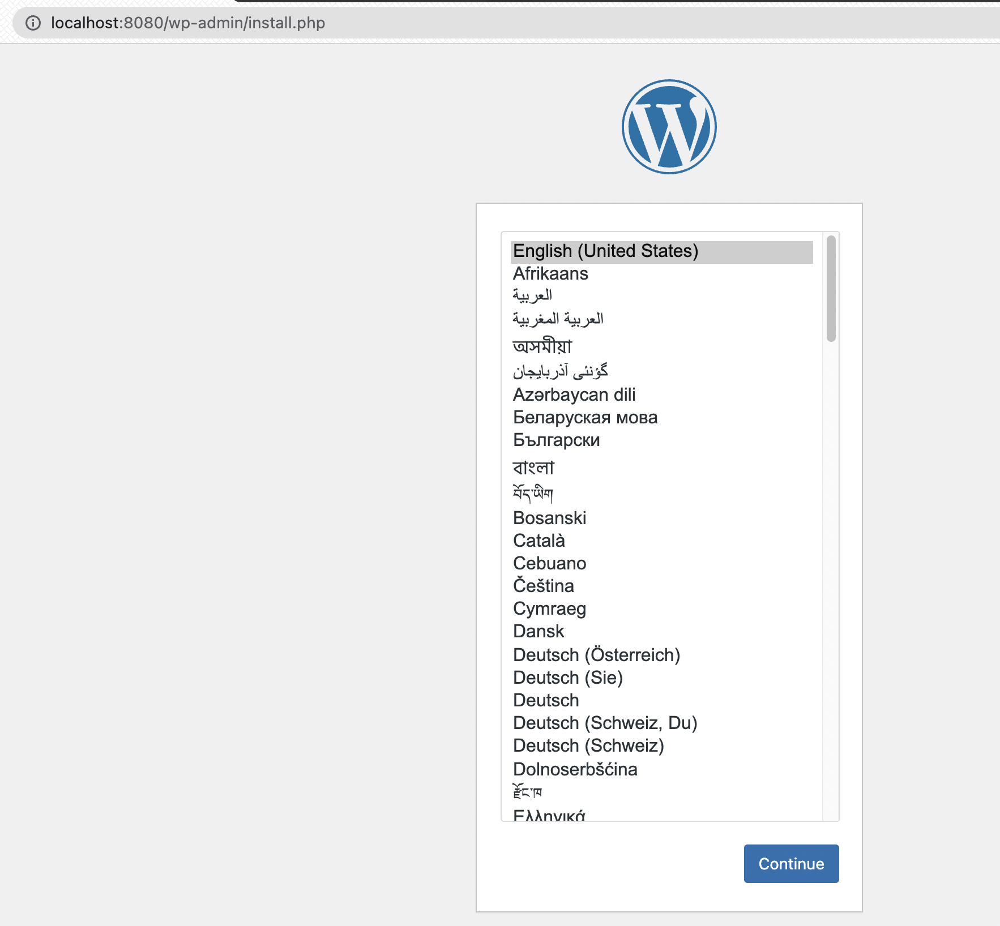

* **docker exec** : `exec `명령어는 run 명령어와 달리 <u>실행 중인 도커 컨테이너에 접속할 때</u> 사용하며 컨테이너 안에 ssh server등을 설치하지 않고 exec 명령어로 접속한다.


# 추가 실습

### MySQL 실행

```shell
soyun@yunsoyun-ui-MacBookPro ~ % docker run -d -p 3306:3306 \
-e MYSQL_ALLOW_EMPTY_PASSWORD=true \
--platform linux/amd64 \
--name mysql \
mysql:5.7
befb31a73c245ff1a3bfe89a12e161f6be0c30d289cce7a58c981b10696a206f
soyun@yunsoyun-ui-MacBookPro ~ % 

soyun@yunsoyun-ui-MacBookPro docker % docker exec -it mysql mysql
Welcome to the MySQL monitor.  Commands end with ; or \g.
```

* `d` 옵션을 통해 백그라운드 실행

* MySQL에서 wordprocessor 실행

  ```mysql
  mysql> create database wp CHARACTER SET utf8;
  Query OK, 1 row affected (0.01 sec)
  
  mysql> grant all privileges on wp.* to wp@'%' identified by 'wp';
  Query OK, 0 rows affected, 1 warning (0.02 sec)
  
  mysql> flush privileges;
  Query OK, 0 rows affected (0.01 sec)
  ```

* 워드 프레스 블로그 실행하기

  ```shell
  soyun@yunsoyun-ui-MacBookPro docker % docker run -d -p 8080:80 \
    -e WORDPRESS_DB_HOST=host.docker.internal \
    -e WORDPRESS_DB_NAME=wp \
    -e WORDPRESS_DB_USER=wp \
    -e WORDPRESS_DB_PASSWORD=wp \
    wordpress
    d326fd7e892213ca8873189947304fc3a68c053958bd2df9d9566eac2bc55e92
  ```

  * `localhost:8080` 으로 접속

    

* 유저 등록 후 DB 확인

  ```shell
  mysql> show databases;
  +--------------------+
  | Database           |
  +--------------------+
  | information_schema |
  | mysql              |
  | performance_schema |
  | sys                |
  | wp                 |
  +--------------------+
  5 rows in set (0.01 sec)
  
  mysql> use wp
  Reading table information for completion of table and column names
  You can turn off this feature to get a quicker startup with -A
  
  Database changed
  mysql> show tables;
  +-----------------------+
  | Tables_in_wp          |
  +-----------------------+
  | wp_commentmeta        |
  | wp_comments           |
  | wp_links              |
  | wp_options            |
  | wp_postmeta           |
  | wp_posts              |
  | wp_term_relationships |
  | wp_term_taxonomy      |
  | wp_termmeta           |
  | wp_terms              |
  | wp_usermeta           |
  | wp_users              |
  +-----------------------+
  12 rows in set (0.00 sec)
  
  mysql> select * from wp_users;
  +----+------------+------------------------------------+---------------+---------------------+-----------------------+---------------------+---------------------+-------------+--------------+
  | ID | user_login | user_pass                          | user_nicename | user_email          | user_url              | user_registered     | user_activation_key | user_status | display_name |
  +----+------------+------------------------------------+---------------+---------------------+-----------------------+---------------------+---------------------+-------------+--------------+
  |  1 | soyoun3963 | $P$B9lmV0cSOmf46qlaz51IfPyvjrMN.t1 | soyoun3963    | soyun3963@gmail.com | http://localhost:8080 | 2021-10-27 14:25:22 |                     |           0 | soyoun3963   |
  +----+------------+------------------------------------+---------------+---------------------+-----------------------+---------------------+---------------------+-------------+--------------+
  1 row in set (0.00 sec)
  ```

  * 중요한 데이터 관련 컨테이너 : `volume mount (-v)` 
    * `-v /my/own/datadir:/var/lib/mysql`
  
  ```shell
  docker run -d -p 3306:3306 \
    -e MYSQL_ALLOW_EMPTY_PASSWORD=true \
    --network=app-network \
    --name mysql \
    -v /my/own/datadir:/var/lib/mysql \
    mysql:5.7
  ```
  
  
  
  

