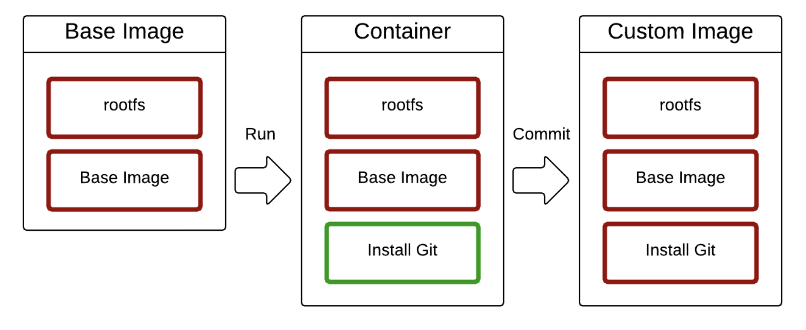
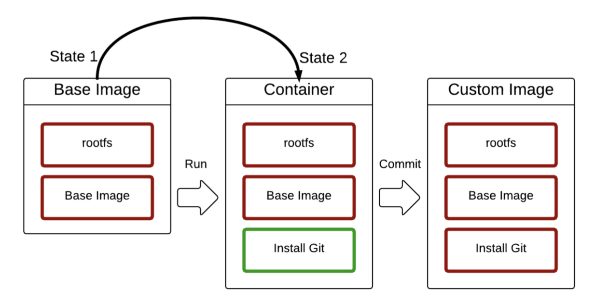

# 도커 이미지


## 읽기 전용 vs 쓰기 가능

* Base Image : 읽기 전용 ( 수정 불가능 )
* 상태 변화
  * commit 명령어 -> Git이 포함된 새로운 이미지 생성됨



* 새로운 상태를 이미지로 저장!



### 실습

**ubuntu 활용하여 git을 가진 이미지 생성하기**

```shell
soyun@yunsoyun-ui-MacBookPro docker % docker images | grep ubuntu
ubuntu              20.04     d5ca7a445605   2 weeks ago    65.6MB
``` ```
soyun@yunsoyun-ui-MacBookPro docker % docker run -it --name git ubuntu:20.04 bash
root@ce3e8c0d9ea2:/# ls
bin  boot  dev  etc  home  lib  media  mnt  opt  proc  root  run  sbin  srv  sys  tmp  usr  var
```

* Git 설치

```shell
root@ce3e8c0d9ea2:/# git
bash: git: command not found
root@ce3e8c0d9ea2:/# apt-get update
Get:1 http://ports.ubuntu.com/ubuntu-ports focal InRelease [265 kB]
Get:2 http://ports.ubuntu.com/ubuntu-ports focal-updates InRelease [114 kB]
Get:3 http://ports.ubuntu.com/ubuntu-ports focal-backports InRelease [101 kB]
Get:4 http://ports.ubuntu.com/ubuntu-ports focal-security InRelease [114 kB]
Get:5 http://ports.ubuntu.com/ubuntu-ports focal/multiverse arm64 Packages [139 kB]
Get:6 http://ports.ubuntu.com/ubuntu-ports focal/universe arm64 Packages [11.1 MB]
Get:7 http://ports.ubuntu.com/ubuntu-ports focal/restricted arm64 Packages [1317 B]
Get:8 http://ports.ubuntu.com/ubuntu-ports focal/main arm64 Packages [1234 kB]                                                                                             
Get:9 http://ports.ubuntu.com/ubuntu-ports focal-updates/main arm64 Packages [1187 kB]                                                                                     
Get:10 http://ports.ubuntu.com/ubuntu-ports focal-updates/restricted arm64 Packages [3332 B]                                                                               
Get:11 http://ports.ubuntu.com/ubuntu-ports focal-updates/universe arm64 Packages [1028 kB]                                                                                
Get:12 http://ports.ubuntu.com/ubuntu-ports focal-updates/multiverse arm64 Packages [8778 B]                                                                               
Get:13 http://ports.ubuntu.com/ubuntu-ports focal-backports/main arm64 Packages [2680 B]                                                                                   
Get:14 http://ports.ubuntu.com/ubuntu-ports focal-backports/universe arm64 Packages [7173 B]                                                                               
Get:15 http://ports.ubuntu.com/ubuntu-ports focal-security/main arm64 Packages [772 kB]                                                                                    
Get:16 http://ports.ubuntu.com/ubuntu-ports focal-security/universe arm64 Packages [742 kB]                                                                                
Get:17 http://ports.ubuntu.com/ubuntu-ports focal-security/restricted arm64 Packages [3087 B]                                                                              
Get:18 http://ports.ubuntu.com/ubuntu-ports focal-security/multiverse arm64 Packages [3243 B]                                                                              
Fetched 16.8 MB in 7s (2399 kB/s)                                                                                                                                          
Reading package lists... Done
root@ce3e8c0d9ea2:/# apt-get install -y git
root@ce3e8c0d9ea2:/# git --version
git version 2.25.1
```

* git이 설치된 컨테이너를 ubuntu의 git이라는 태그로 commit !

```shell
soyun@yunsoyun-ui-MacBookPro docker % docker commit git ubuntu:git
sha256:6e4f49188e0946a63b2d58f344c94fd4a668e454c3123d354ec764f853cf8431
```

* 생성 확인

```shell
soyun@yunsoyun-ui-MacBookPro docker % docker images | grep ubuntu                
ubuntu              git       6e4f49188e09   About a minute ago   191MB
ubuntu              20.04     d5ca7a445605   2 weeks ago          65.6MB
```

* 해당 이미지 활용해서 git2라는 컨테이너 생성

```shell
soyun@yunsoyun-ui-MacBookPro docker % docker run -it --name git2 ubuntu:git bash
root@6ac4ab01daff:/# 
```


# Dockerfile

* 어떤 작업을 거쳐서 프로그램이 설치되었는 지를 알 수 있다 = history !

```shell
docker build -t {이름/이미지이름:tag} {빌드 컨택스트}
*docker build -t soyoun/ubuntu:git01*
```

| FROM       | 기본 이미지                                          |
| ---------- | ---------------------------------------------------- |
| RUN        | 쉘 명령어 실행                                       |
| CMD        | 컨테이너 기본 실행 명령어 (Entrypoint의 인자로 사용) |
| EXPOSE     | 오픈되는 포트 정보                                   |
| ENV        | 환경변수 설정                                        |
| ADD        | 파일 또는 디렉토리 추가. URL/ZIP 사용가능            |
| COPY       | 파일 또는 디렉토리 추가                              |
| ENTRYPOINT | 컨테이너 기본 실행 명령어                            |

| VOLUME  | 외부 마운트 포인트 생성                       |
| ------- | --------------------------------------------- |
| USER    | RUN, CMD, ENTRYPOINT를 실행하는 사용자        |
| WORKDIR | 작업 디렉토리 설정                            |
| ARGS    | 빌드타임 환경변수 설정                        |
| LABEL   | key - value 데이터                            |
| ONBUILD | 다른 빌드의 베이스로 사용될때 사용하는 명령어 |

* 현재 디렉토리의 Dockerfile로 빌드
* `-f<Dockerfile>` 옵션을 사용해 다른 위치의 Dockerfile파일 사용 가능
* `-t` 명령어로 도커 이미지 이름 결정
* [네임스페이스]/[이미지이름]:[태그] 형식
* 마지막에는 빌드컨텍스트 위치 지정
  * 현재 디렉터리 의미하는 `.` 주로 사용
  * 필요한 경우 다른 디렉터리 지정 가능
* `.dockerignore` : 도커 빌드 컨텍스트에서 지정된 패턴의 파일을 무시
  * *이미지 빌드 시에 사용하는 파일은 제외시키면 안 됨*

### 실습

```shell
soyun@yunsoyun-ui-MacBookPro git % cat Dockerfile 
FROM ubuntu:latest
RUN apt-get update
RUN apt-get install -y git
soyun@yunsoyun-ui-MacBookPro git % docker build -t ubuntu:git-dockerfile .
[+] Building 22.2s (8/8) FINISHED
soyun@yunsoyun-ui-MacBookPro git % docker images
REPOSITORY          TAG              IMAGE ID       CREATED          SIZE
ubuntu              git-dockerfile   a76c49baf181   19 seconds ago   191MB

soyun@yunsoyun-ui-MacBookPro git % docker run -it --name git3 ubuntu:git-dockerfile bash
root@fff3a27d0a90:/# git
```

