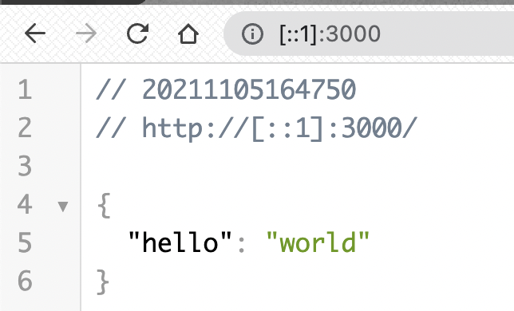
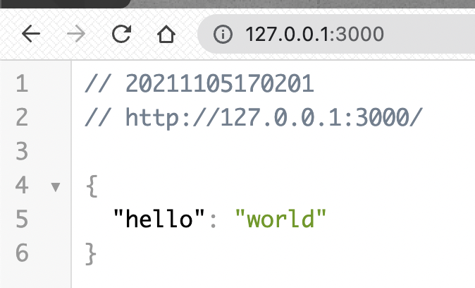

# Nodejs 웹 애플리케이션

* npm 설치

  ```shell
  $ brew update
  $ brew install node
  
  # npm 초기화
  soyun@yunsoyun-ui-MacBookPro web % npm init
  Is this OK? (yes) 
  npm notice 
  npm notice New patch version of npm available! 8.1.0 -> 8.1.3
  npm notice Changelog: https://github.com/npm/cli/releases/tag/v8.1.3
  npm notice Run npm install -g npm@8.1.3 to update!
  npm notice 
  ```

* fastify : https://www.fastify.io/docs/latest/Getting-Started/

  * Library 설치

  ```shell
  soyun@yunsoyun-ui-MacBookPro web % npm i fastify --save
  ```

  * app.js

  ```javascript
  const fastify = require('fastify')({
    logger: true
  })
  
  // Declare a route
  fastify.get('/', function (request, reply) {
    reply.send({ hello: 'world' })
  })
  
  // Run the server!
  fastify.listen(3000, '0.0.0.0', function (err, address) {
    if (err) {
      fastify.log.error(err)
      process.exit(1)
    }
    fastify.log.info('server listening on ${address}')
  })
  ```

  * 실행

  ```shell
  soyun@yunsoyun-ui-MacBookPro web % node app.js
  {"level":30,"time":1636098401214,"pid":82451,"hostname":"yunsoyun-ui-MacBookPro.local","msg":"Server listening at http://[::1]:3000"}
  {"level":30,"time":1636098401214,"pid":82451,"hostname":"yunsoyun-ui-MacBookPro.local","msg":"server listening on ${address}"}
  ```

  

* Dockerfile 만들기

```shell
soyun@yunsoyun-ui-MacBookPro web % cat Dockerfile 
# 1. node 설치
FROM ubuntu:20.04
RUN apt-get update
RUN DEBIAN_FRONTEND=noninteractive apt-get install -y nodejs npm

# 2. 소스 복사
COPY . /usr/src/app

# 3. Nodejs 패키지 설치
WORKDIR /usr/src/app
RUN     npm install

# 4. WEB 서버 실행 (Listen 포트 정의)
EXPOSE 3000
CMD node app.js
```

* build

```shell
soyun@yunsoyun-ui-MacBookPro web % docker build -t web . 
[+] Building 78.7s (12/12) FINISHED   
soyun@yunsoyun-ui-MacBookPro web % docker images
REPOSITORY          TAG              IMAGE ID       CREATED              SIZE
web                 latest           b0e3b71ef714   About a minute ago   598MB
```

* 실행

```shell
soyun@yunsoyun-ui-MacBookPro web % docker run -p 3000:3000 web
{"level":30,"time":1636099273922,"pid":8,"hostname":"ede32b829a52","msg":"Server listening at http://0.0.0.0:3000"}
{"level":30,"time":1636099273922,"pid":8,"hostname":"ede32b829a52","msg":"server listening on ${address}"}
```



